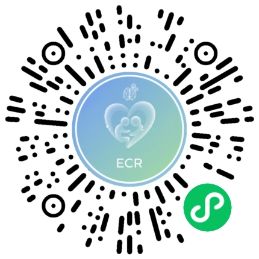

# ECR Attachment Assessment Mini Program

**[中文](README.md) | [English](README_EN.md)**

A WeChat Mini Program for ECR attachment style assessment, helping you understand your patterns in close relationships.

---

## ✨ Key Features

### 📋 Complete Assessment
- **36 Questions** - Based on the validated ECR scale
- **Real-time Progress** - Track your progress as you answer
- **Instant Scoring** - Quick calculation of anxiety and avoidance dimensions
- **Detailed Results** - Personalized attachment style analysis

### 📊 Visual Display
- **Radar Chart** - Visual representation of your attachment dimensions
- **Four Types** - Secure, Anxious, Avoidant, Fearful
- **Score Explanation** - Understand what each dimension means

### 🎨 User Experience
- **Responsive Design** - Works on all screen sizes
- **Smooth Flow** - Clear and simple assessment process
- **No Registration** - Start testing immediately

### 🔒 Privacy Protection
- **Local Processing** - All calculations done locally
- **No Data Collection** - No personal information required
- **Local Storage** - Results saved only on your device

---

## 🚀 Getting Started

### Requirements
- WeChat Developer Tools
- WeChat Basic Library 2.19.1+

### How to Run
1. Download or clone the project
2. Open the project in WeChat Developer Tools
3. Select project path: `/home/jiadong/yinyu/weapp-ecr-assessment`
4. Click "Compile" to run

---

## 📬 Mini Program QR code

---

## 📖 Assessment Flow

1. **Home Page** - Read the instructions, tap "Start Test"
2. **Answer** - Complete 36 multiple-choice questions
3. **Results** - View your attachment analysis, radar chart, and recommendations

---

## 🧩 What is Attachment Style?

Attachment style refers to our patterns of behavior and emotion in close relationships. The ECR scale measures two main dimensions:

| Dimension | Meaning |
|-----------|---------|
| **Anxiety** | Degree of fear about being abandoned |
| **Avoidance** | Tendency to keep distance from others |

Based on these two dimensions, people fall into four attachment types:

| Type | Characteristics |
|------|-----------------|
| **Secure** | Enjoys closeness, trusts partner |
| **Anxious** | Desires closeness, fears abandonment |
| **Avoidant** | Independent, doesn't rely on others |
| **Fearful** | Desires closeness but fears getting hurt |

---

## 📚 About the ECR Scale

The ECR (Experiences in Close Relationships) scale used in this program was developed by psychologists Fraley, Waller, and Brennan in 2000. It is a widely-used psychological measurement tool in attachment research.

---

## 📄 License

This project is licensed under the MIT License.

---

## ⚠️ Disclaimer

This application is for self-assessment and educational purposes only. It does not constitute professional psychological advice. If you are experiencing psychological distress, please consult a professional psychologist.

---

**Understand yourself, connect with love ❤️**

